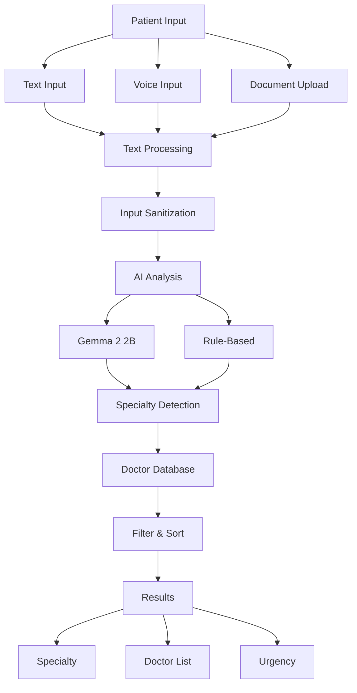

# System Architecture

## Overview

Simple five-layer architecture for AI-powered doctor recommendations.

## Architecture Flow

## Layer Details

**1. Input Layer**: Multi-modal input (text, voice, documents)

**2. Processing Layer**: Text extraction and sanitization with security validation

**3. AI Analysis Layer**: Gemma 2 2B with rule-based fallback for specialty detection

**4. Matching Layer**: Filter and sort doctors by specialty, rating, and price

**5. Output Layer**: Display results with specialty, doctor list, and urgency flags

## Key Features

- **Privacy**: All processing runs locally
- **Reliability**: Hybrid AI + rule-based approach
- **Security**: Input validation and prompt injection protection
- **Performance**: Results in < 2 seconds
